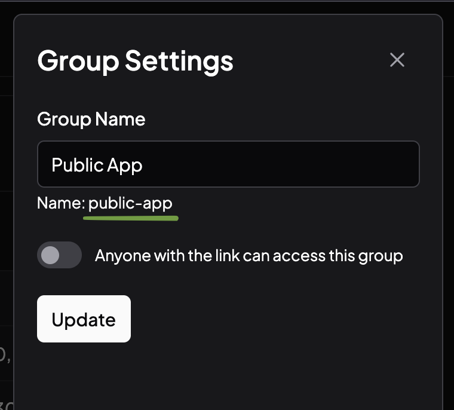

# CLI Usage

## Install CLI

Run the following command to install CLI

```bash
npm -g install distapp
```

*node is required (tested on 20.17.0)*

Or use bun

```bash
bun -g install distapp
```

## Generate API Key

1. Go to your apps (e.g Habit Tool - Android)
1. Open settings icon in the top right
1. Open API Keys tab
1. Click "Generate Token" and copy the token

## Distribute to DistApp

Distribute apk, aab and ipa using the following command:

```bash
distapp distribute \
    --file "$PATH_TO_ARTIFACT" \
    --slug "$APP_SLUG" \
    --api-key "$API_KEY"
```

- `$PATH_TO_ARTIFACT` Can be apk, aab or ipa
- `$APP_SLUG` Is a combination of org and app name, e.g `yedev/habit-tool`. You can copy slug in `App Settings` -> `App Info`
- `$API_KEY` Add your API Key, created in `App Settings` -> `API Keys`

If you self-hosted DistApp, specify the url using `--url` option, e.g `--url https://mydistapp.com`

### Distribute to Groups

Add `--group` option to distribute to group, specify multiple times if you want to send to multiple group. You can get your group name from Group Settings or using last segment URL of the group.

{width=400px}

Example:

```bash
distapp distribute \
    --file "$PATH_TO_ARTIFACT" \
    --slug "$APP_SLUG" \
    --api-key "$API_KEY" \
    --group "public-app"
```
